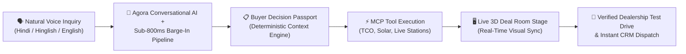
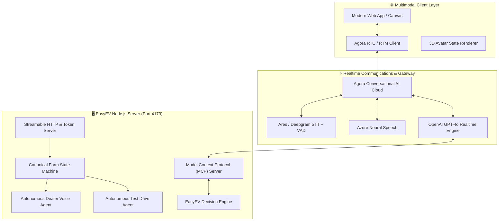

<div align="center">

  

  # ⚡ EasyEV AI
  ### **India's Autonomous AI-Guided EV Discovery, Negotiation & Action Platform**
  
  [](https://www.agora.io/)
  [](https://docs.agora.io/)
  [](https://modelcontextprotocol.io/)
  [](https://openai.com/)
  [](https://azure.microsoft.com/services/cognitive-services/text-to-speech/)
  [](https://nodejs.org/)

  <br/>
  
  > **From the first voice question to an instant dealership test drive.**  
  > Bridging India's EV adoption gap with full-duplex conversational voice AI, interactive 3D visual deal rooms, autonomous dealer onboarding, and live real-time decision tooling.

  <p align="center">
    <a href="#-interactive-character-avatar--hero-showcase"><strong>🎬 Hero Showcase</strong></a> •
    <a href="#-the-problem--our-breakthrough"><strong>💡 The Breakthrough</strong></a> •
    <a href="#-core-technological-innovations"><strong>🚀 Core Innovations</strong></a> •
    <a href="#-system-architecture--data-flow"><strong>🏗️ Architecture</strong></a> •
    <a href="#-comprehensive-multi-category-ev-fleet"><strong>🚗 EV Fleet</strong></a> •
    <a href="#-developer-quickstart"><strong>⚡ Quickstart</strong></a>
  </p>

</div>

---

<a name="-interactive-character-avatar--hero-showcase"></a>
## 🎬 Interactive Character Avatar & Hero Showcase

EasyEV doesn't just chat; it presents. Our custom 3D avatar dynamically responds to the Agora speech pipeline with zero-lag state visualization, syncing realtime speech with visual deal-room telemetry.

<div align="center">

  <table>
    <tr>
      <td width="55%" align="center">
        <!-- High-fidelity HTML5 Video Embed -->
        <video src="assets/easyev-hero-consultation.mp4" width="100%" autoplay loop muted playsinline style="border-radius: 16px; box-shadow: 0 12px 40px rgba(0,0,0,0.4);">
          
        </video>
        <br/>
        <em>🤖 <strong>EasyEV 3D AI Guide</strong> — Full-duplex conversational avatar.</em>
      </td>
      <td width="45%" align="center">
        
        <br/>
        <em>💻 <strong>AI-Controlled Deal Room</strong> — Dynamic presentation stage & live map.</em>
      </td>
    </tr>
  </table>

</div>

### 🎭 Conversational AI Emotional & Cognitive States

<div align="center">

| 👂 **Listening** | 🧠 **Thinking & MCP Query** | 🗣️ **Presenting & Guiding** | ✅ **Decision Achieved** |
| :---: | :---: | :---: | :---: |
|  |  |  |  |
| *Active VAD & Barge-in* | *Real-time Tool Engine Calls* | *Synchronized Visual Cards* | *Instant CRM / Test Drive Booked* |

</div>

---

<a name="-the-problem--our-breakthrough"></a>
## 💡 The Problem & Our Breakthrough

### 🚨 The Indian EV Adoption Crisis
Transitioning to Electric Mobility in India is plagued with cognitive friction:
1. **Range & Charging Anxiety**: Buyers cannot map real-world battery degradation vs. local hill terrains and extreme summer heat.
2. **Total Cost of Ownership (TCO) Complexity**: Complex state subsidies, fluctuating power tariffs, and confusing ICE vs. EV math.
3. **Hyper-Fragmented Dealerships**: Finding certified test drive slots across OEM brands requires visiting 4–5 different showrooms.
4. **Dealer Onboarding Bottleneck**: Dealerships abandon complex digital registration forms.

### 🌟 The EasyEV Connected Loop
EasyEV orchestrates a **deterministic, multimodal buying journey**:



---

<a name="-core-technological-innovations"></a>
## 🚀 Core Technological Innovations

### 1. 🎙️ Ultra-Low Latency Conversational Voice Pipeline
Powered by **Agora Conversational AI SDK** and **Microsoft Azure Neural Voices** (`hi-IN-MadhurNeural`, `hi-IN-AaravNeural`).
- **Instant Barge-In**: Built-in Voice Activity Detection (VAD) stops the agent mid-sentence the moment the human speaks.
- **Dialect Native**: Fluent in Hindi, English, and colloquial Hinglish (e.g., *"bhai 15 lakh ke budget me kaunsi car sahi rahegi?"*).

### 2. 🏢 Autonomous Dealer Onboarding Voice Agent
A breakthrough in voice-form filling (`dealer-voice-agent.mjs`), completely eliminating web forms for EV vendors.
- **150+ Colloquial Affirmations**: Accurately extracts values even when wrapped in slang (*"haa Shakti Motors daldo"*, *"dono milta hai bhai"*, *"हाँ बिल्कुल"*).
- **Strict Word-Boundary Regex**: Zero false-positives (prevents letters in names from triggering intents).
- **Multi-Stage Transactional Submission**: Real-time SMTP transactional email dispatch with audit logs.

<details>
<summary><strong>🔍 Peek into the 150+ Affirmation Engine (Real Code)</strong></summary>

```javascript
// dealer-voice-agent.mjs
const affPattern = /\b(?:haan+|ha+|haaji|haanji|ji\s*haan|yes+|yeah+|sure+|ok+|absolutely|definitely|exactly|right|correct|theek|thik|sahi|sahi\s*hai|bilkul|ekdam\s*sahi|chalega|available|milta\s*hai|dete\s*hain|karwate\s*hai|karte\s*hai|kardo|daldo|likh\s*do|rakh\s*do|add\s*kardo|sab\s*hai|saare\s*brands|dono\s*dete|submit\s*kardo|h|hai)\b/i;
```
</details>

### 3. 🛠️ Model Context Protocol (MCP) & Autonomous Decision Tools
EasyEV implements an enterprise **Streamable HTTP MCP Server** (`/mcp`) exposing deterministic decision tools (`decision-tools.mjs`) directly to the LLM agent:

| MCP Tool Name | Capability |
|---|---|
| `search_vehicles` | Semantic search across the 12-EV catalog (Cars, Scooters, Autos) |
| `calculate_ev_tco` | 5-Year lifecycle savings analysis factoring Indian electricity slab tariffs |
| `find_charging_stations` | Integration resolving nearest CCS2/Type-2 fast chargers with route waypoints |
| `schedule_test_drive` | Real-time calendar slot resolution and HubSpot CRM lead sync |
| `generate_decision_passport` | Server-side PDF generation producing a verified buyer decision record |

---

<a name="-system-architecture--data-flow"></a>
## 🏗️ System Architecture & Data Flow



---

<a name="-comprehensive-multi-category-ev-fleet"></a>
## 🚗 Comprehensive Multi-Category EV Fleet

Decision intelligence across **all three core Indian EV categories**:

### 🚙 1. Electric Passenger Cars (4-Wheelers)
<div align="center">

| Tata Nexon EV | Tata Punch EV | MG Windsor EV | Mahindra XUV400 |
| :---: | :---: | :---: | :---: |
|  |  |  |  |
| **465 km** • 40.5 kWh | **421 km** • 35 kWh | **331 km** • BaaS: ₹3.5/km | **456 km** • 39.4 kWh |

</div>

### 🛵 2. Electric Scooters & Commuters (2-Wheelers)
<div align="center">

| Ather 450X | Ather Rizta | Ola S1 Pro | TVS iQube |
| :---: | :---: | :---: | :---: |
|  |  |  |  |
| **110 km** TrueRange | **160 km** • 34L Boot | **195 km** • HyperMode | **145 km** • Q-Park Assist |

</div>

### 🛺 3. Commercial & Auto-Rickshaws (3-Wheelers)
<div align="center">

| Mahindra Treo Plus | Piaggio Ape E-City | Euler HiLoad EV | Bajaj RE E-Tec 9.0 |
| :---: | :---: | :---: | :---: |
|  |  |  |  |
| **500 kg** Payload | **110 km** • Swappable | **688 kg** Payload | **178 km** • Fast Charging |

</div>

---

<a name="-interactive-tools--screens"></a>
## 🗺️ Live Range Simulation & Route Mapping

<div align="center">

  
  <p><em>Realtime dynamic isochrone range contour mapping factoring payload weight, AC usage, driving elevation, and nearest fast-charging stops.</em></p>

</div>

---

<a name="-developer-quickstart"></a>
## ⚡ Developer Quickstart

### Prerequisites
* **Node.js**: `v22.0.0` or higher
* **Agora Developer Account**: App ID and App Certificate
* **OpenAI API Key**

### 1. Clone & Install
```bash
git clone https://github.com/shhhivam12/easyev.git
cd easyev
npm install
```

### 2. Configure Environment Variables (`.env`)
```env
PORT=4173
PUBLIC_BASE_URL=http://localhost:4173

# Agora Realtime Credentials
AGORA_APP_ID="your_agora_app_id"
AGORA_APP_CERTIFICATE="your_agora_app_certificate"

# LLM & Voice Keys
OPENAI_API_KEY="your_openai_api_key"
AZURE_SPEECH_KEY="your_azure_speech_key"
AZURE_SPEECH_REGION="centralindia"
```

### 3. Build & Run
```bash
# Build bundled client assets and start the enterprise server
npm run dev
# 🚀 http://localhost:4173
```

### 4. Run Test & Verification Suites
```bash
# Run comprehensive deep enterprise verification suite (29/29 Passing)
node scripts/test-dealer-agent-deep.mjs
```

---

<div align="center">

  ### 🏆 Built with Passion for the Future of Electric Mobility
  
  **EasyEV AI** • *Intelligent, Impartial, and Instant EV Decision Making*

  <p>
    <a href="https://github.com/shhhivam12/easyev">Star us on GitHub ⭐</a> • 
    <a href="mailto:support@easyev.in">Contact Team</a>
  </p>

</div>
